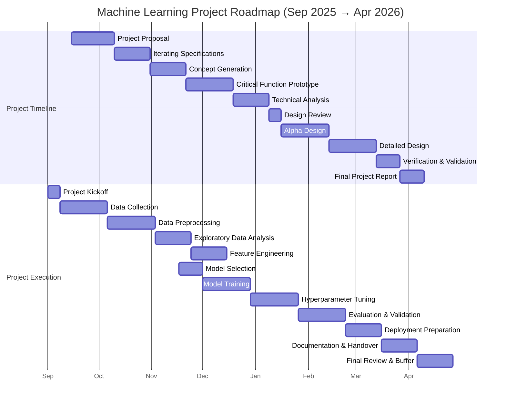

# Project Roadmap

The Gantt chart below aims to illustrate our project roadmap for the next 8 months, which includes expected project
milestones, timelines, and dependencies.

```mermaid
gantt
    title Machine Learning Project Roadmap (Sep 2025 → Apr 2026)
    dateFormat  MM-DD-YYYY
    axisFormat  %b
    todayMarker off

    section Project Timeline
    Project Proposal                :proposal,    09-15-2025, 10-10-2025
    Iterating Specifications        :specs,       10-10-2025, 3w
    Concept Generation              :concept,     after specs, 3w
    Critical Function Prototype     :cfp,         after concept, 4w
    Technical Analysis              :tech,        after cfp, 3w
    Design Review                   :review,      after tech, 1w
    Alpha Design                    :alpha,       after review, 4w
    Detailed Design                 :detailed,    after alpha, 4w
    Verification & Validation       :vnv,         after detailed, 2w
    Final Project Report            :report,      after vnv, 2w

    section Project Execution
    Project Kickoff                 :kickoff,     09-01-2025, 1w
    Data Collection                 :data,        09-08-2025, 4w
    Data Preprocessing              :prep,        after data, 4w
    Exploratory Data Analysis       :eda,         after prep, 3w
    Feature Engineering             :fe,          after eda, 3w
    Model Selection                 :select,      11-17-2025, 2w
    Model Training                  :train,       12-01-2025, 4w
    Hyperparameter Tuning           :tune,        12-29-2025, 4w
    Evaluation & Validation         :eval,        01-26-2026, 4w
    Deployment Preparation          :deployprep,  02-23-2026, 3w
    Documentation & Handover        :docs,        03-16-2026, 3w
    Final Review & Buffer           :reviewbuf,   04-06-2026, 3w
```
