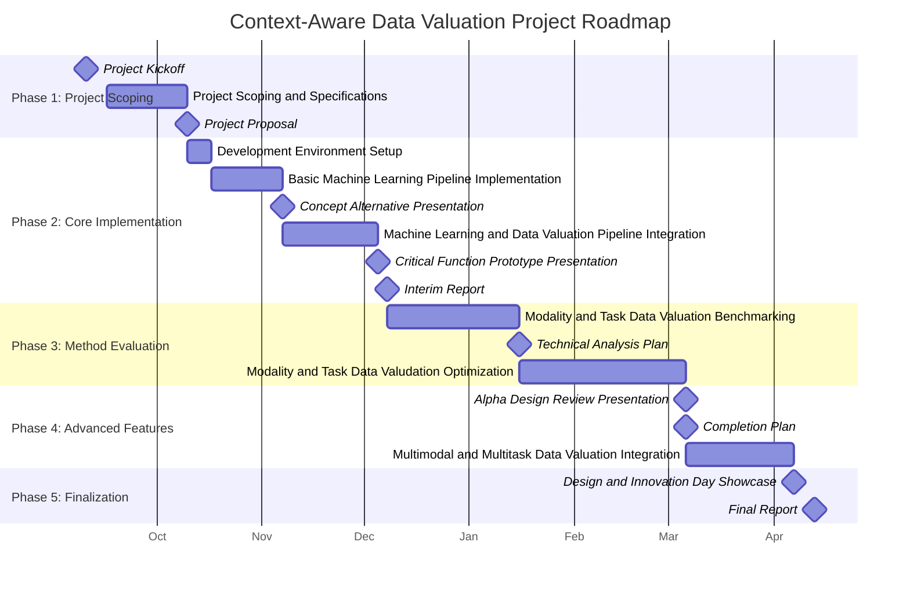

# Project Roadmap

The Gantt chart below illustrates our project roadmap over the next 8 months, which overviews expected project milestones, timelines, and dependencies.

```mermaid
gantt
    title Context-Aware Data Valuation Project Roadmap
    dateFormat  MM-DD-YYYY
    axisFormat  %b

    section Phase 1: Project Scoping
    Project Kickoff                             :milestone, m1, 09-10-2025, 0d
    Project Scoping and Specifications          :a1, 09-16-2025, 10-10-2025
    Project Proposal                            :milestone, m2, 10-10-2025, 0d

    section Phase 2: Core Implementation
    Development Environment Setup                               :b1, 10-10-2025, 10-17-2025
    Basic Machine Learning Pipeline Implementation              :b2, 10-17-2025, 11-07-2025
    Concept Alternative Presentation                            :milestone, m3, 11-07-2025, 0d
    Machine Learning and Data Valuation Pipeline Integration    :b3, 11-07-2025, 12-05-2025
    Critical Function Prototype Presentation                    :milestone, m4, 12-5-2025, 0d
    Interim Report                                              :milestone, m5, 12-8-2025, 0d

    section Phase 3: Method Evaluation
    Modality and Task Data Valuation Benchmarking      :c1, 12-08-2025, 01-16-2026
    Technical Analysis Plan                             :milestone, m6, 01-16-2026, 0d
    Modality and Task Data Valudation Optimization      :c2, 01-16-2026, 03-06-2026

    section Phase 4: Advanced Features
    Alpha Design Review Presentation    :milestone, m7, 03-06-2026, 0d
    Completion Plan                     :milestone, m8, 03-06-2026, 0d
    Multimodal and Multitask Data Valuation Integration                    :d1, 03-06-2026, 04-07-2026

    section Phase 5: Finalization
    Design and Innovation Day Showcase      :milestone, m9, 04-07-2026, 0d
    Final Report                            :milestone, m10, 04-13-2026, 0d
```
